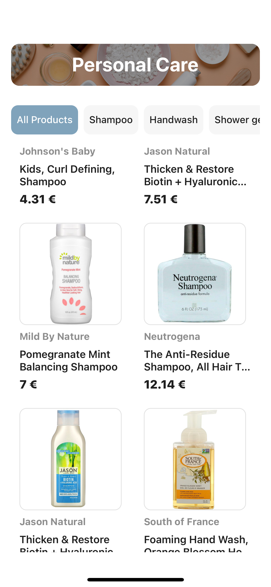

## “Product Category detail page”

There's nothing spesial with the setup, just run 

```
yarn
cd ios && pod install
cd ..

yarn ios
```

I added some changes to the initial task, which are:
1. Border around product's image, as they are white
2. Animation for the title of category to make the scrollable area larger. I used Animated API to save time, but I would use reanimated in prod.
3. Added indexed and images to products schemes, also added image to the scheme of category
4. Added an endpoint `/product` to get all products to make it more simple.

I didn't use any state-management solution, implemented api integration with React Query, used styled-components.

Thank you in advance for any feedback!

Screenshot 1 | Screenshot 2
------------ | -------------
 | 

